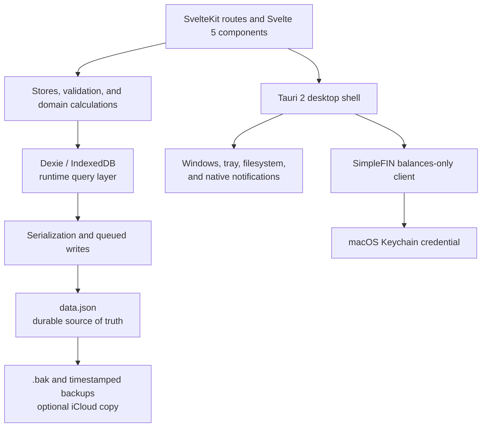

# Ledger

Ledger is a local-first macOS app for manual budgeting and personal-finance analysis. It combines transaction tracking, category budgets, savings plans, shared expenses, and net-worth balances in one desktop application.

“Local-first” means the budget database stays on the Mac. Ledger has no hosted account, application server, or remote database. An optional iCloud backup copies a JSON backup to the user’s own iCloud Drive.

## Status

Ledger is a personal project built around the way I manage my own finances. I use it as my day-to-day budgeting tool and continue to improve it as my needs change.

It has grown into a fairly complete desktop app, with budgeting, savings goals, shared expenses, financial insights, net-worth tracking, native reminders, and automatic backup and recovery.

Its scope is intentionally focused:

- Ledger runs on macOS and is designed for one person.
- Transactions are entered manually or imported from a spreadsheet.
- SimpleFIN supplies account balances for net-worth tracking, not bank transactions.
- Some defaults and workflows are opinionated because they reflect how I actually budget.

## What Ledger does

### Transactions

- Records purchases, subscriptions, notes, and hashtags.
- Searches and filters by merchant, category, amount, date, and tag.
- Splits one purchase across several categories while preserving it as one linked transaction group.
- Separates future-dated entries from completed spending.
- Detects recurring expenses and suggests entries at the start of a month.
- Uses soft deletion with a short undo window.

### Budgets

- Sets monthly income and per-category spending limits.
- Shows spending, remaining amounts, income allocation, and threshold alerts.
- Supports optional category rollover between months.
- Rolls unused amounts forward while treating earlier overspending as a separate one-month adjustment.
- Uses the user’s share of a shared purchase in budget and cash-flow calculations.

### Savings

- Tracks savings, retirement, and investment accounts.
- Records contributions by source, including transfers, payroll deductions, interest, and employer matches.
- Distinguishes contributions that reduce available cash from contributions that do not.
- Tracks goal amounts and dates, projected completion, and the contribution needed to stay on schedule.

### Shared expenses

- Splits expenses with a partner by percentage or fixed amount.
- Tracks the partner’s share separately from the user’s spending.
- Shows the outstanding balance and supports batch settlement.

### Insights

- Summarizes spending, savings, recurring expenses, and yearly activity.
- Compares category spending with previous and typical months.
- Detects unusual spending and changes in spending pace.
- Breaks spending into needs and wants.
- Shows merchant, category, tag, savings-rate, and calendar trends.
- Caches calculations against a transaction version so unchanged data is not recalculated on every render.

### Net worth

- Tracks assets and liabilities with manual balance history.
- Stores at most one balance snapshot per account per day.
- Can read balances from SimpleFIN Bridge on launch or on demand.
- Keeps failed accounts at their last known balance instead of failing the whole sync.

Savings and net worth use separate account models. Savings accounts describe planned contributions and goals. Linked accounts describe actual balances. A bank sync never overwrites savings-plan data.

### macOS integration

- Provides a menu-bar quick-add window.
- Supports native reminders for daily entry, weekly review, and monthly budget setup.
- Keeps the app running when its main window is closed.
- Includes application-wide keyboard shortcuts.

## Architecture

Ledger uses a statically built SvelteKit frontend inside a Tauri desktop shell.



The main layers are:

- **Routes and components** render the application and collect input.
- **Stores and utilities** own database operations, validation, budget rules, transaction grouping, and financial calculations.
- **Dexie** provides indexed queries and reactive data while the application is running.
- **JSON storage** is the durable copy of the database. Ledger loads it into Dexie at startup and writes the full state back after changes.
- **Rust and Tauri** provide the native window lifecycle, menu-bar integration, notifications, and the SimpleFIN connection.

The quick-add window shares the same IndexedDB origin as the main window, but it does not write directly. It sends the completed transaction to the main window, which performs the database update and file save. This keeps one writer responsible for durable storage.

## Data storage and recovery

Ledger stores its main data file at:

```text
~/Library/Application Support/app.ledger.desktop/data.json
```

Each save passes through one queue, so two changes cannot write the same temporary file at the same time. Calls waiting in the queue can be combined into one write.

A durable write:

1. serializes every persisted table;
2. adds a SHA-256 checksum;
3. writes a temporary file;
4. preserves the previous file as `data.json.bak`;
5. renames the temporary file to `data.json`.

Ledger also keeps up to ten timestamped backups. If the main file cannot be parsed or fails its checksum, startup recovery tries `data.json.bak` first and then the timestamped backups from newest to oldest.

When iCloud backup is enabled, Ledger also writes a portable backup to:

```text
~/Library/Mobile Documents/com~apple~CloudDocs/Ledger/ledger-backup.json
```

The settings page can import an Excel transaction sheet, export transactions as CSV, and import or export the complete database as JSON.

## SimpleFIN and account credentials

Ledger uses SimpleFIN only to read account balances. It cannot import transactions or move money.

The Rust backend connects to SimpleFIN and stores the account credential in the macOS Keychain. The Svelte frontend receives the balances but never sees that credential. It is not included in Ledger’s data file, local backups, or iCloud backups.

## Technology

| Area | Implementation |
| --- | --- |
| Application | SvelteKit 2 with the static adapter |
| UI | Svelte 5 runes and Tailwind CSS 4 |
| Desktop shell | Tauri 2 and Rust |
| Runtime queries | Dexie 4 over IndexedDB |
| Durable storage | Checksummed JSON with queued writes and backup recovery |
| Charts | Chart.js with annotation and treemap plugins |
| Spreadsheet import | ExcelJS |
| Tests | Vitest, Testing Library, and Rust unit tests |
| Continuous integration | GitHub Actions on Linux and macOS |

## Repository layout

```text
src/
├── routes/                 Application pages and window entry points
├── lib/
│   ├── components/         Shared Svelte components
│   ├── db/                 Dexie schema, types, defaults, and migrations
│   ├── insights/           Cached financial calculations
│   ├── notifications/      Reminder scheduling and native delivery
│   ├── services/           SimpleFIN frontend boundary
│   ├── storage/            Serialization, file persistence, and recovery
│   ├── stores/             Data operations and reactive state
│   └── utils/              Budget, transaction, date, import, and export logic
└── tests/                  Integration and cross-module tests

src-tauri/
├── capabilities/           Tauri filesystem and notification permissions
└── src/
    ├── lib.rs              Application lifecycle, tray, and window handling
    └── simplefin.rs        SimpleFIN client and Keychain access

.github/workflows/ci.yml    Frontend and Rust verification
```

## Development

### Requirements

- macOS
- Node.js 22 and npm
- A stable Rust toolchain
- Xcode Command Line Tools and the other [Tauri prerequisites](https://v2.tauri.app/start/prerequisites/)

Install dependencies and start the desktop application:

```bash
npm ci
npm run tauri:dev
```

Run the frontend without the Tauri shell:

```bash
npm run dev
```

The frontend-only server is useful for UI work, but it does not reproduce native storage, menu-bar, notification, Keychain, or SimpleFIN behavior.

Run the frontend checks:

```bash
npm run lint
npm run check
npm run test:run
```

Run the Rust checks:

```bash
cargo clippy --manifest-path src-tauri/Cargo.toml --all-targets -- -D warnings
cargo test --manifest-path src-tauri/Cargo.toml
```

Build the macOS application:

```bash
npm run tauri:build
```

## License

Ledger is available under the [MIT License](./LICENSE).
