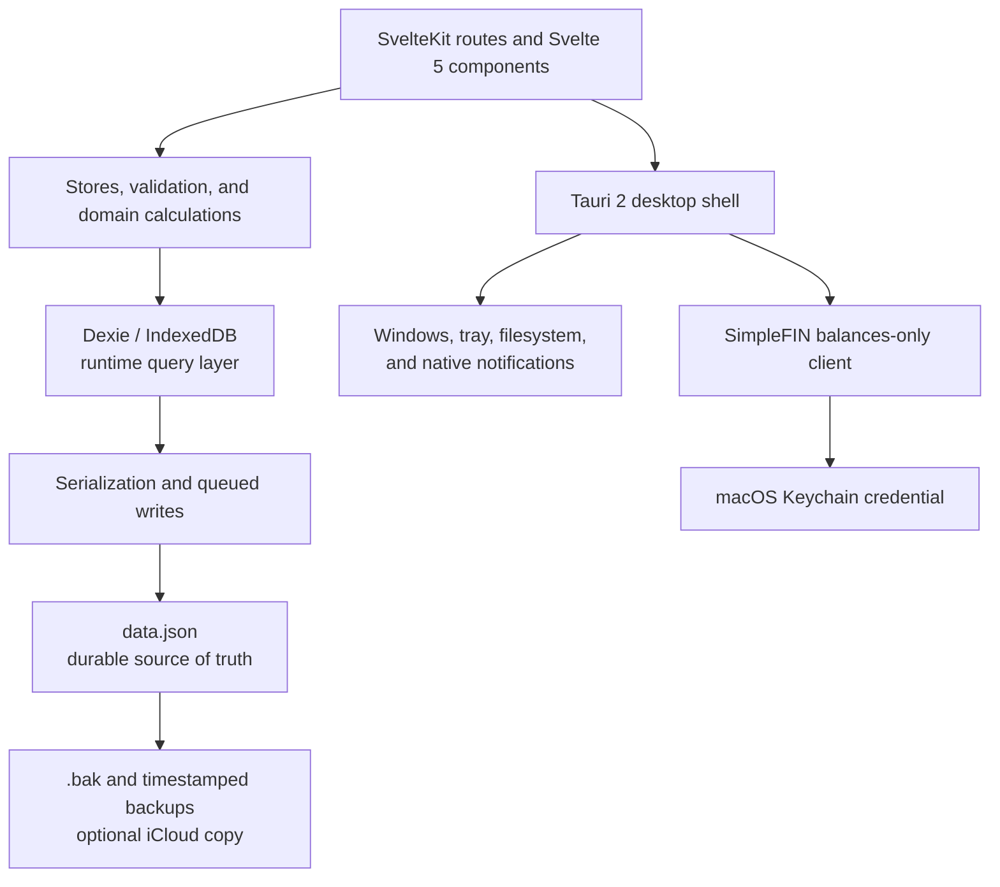

# Ledger

Ledger is a local-first macOS app for manual budgeting and personal-finance analysis. It combines transaction tracking, category budgets, savings goals, shared expenses, a month-end spending forecast, and net-worth balances in one desktop application.

“Local-first” means the budget database stays on the Mac. Ledger has no hosted account, application server, or remote database. An optional iCloud backup copies a JSON backup to the user’s own iCloud Drive.

## Documentation

| Document | Purpose |
| --- | --- |
| [AGENTS.md](AGENTS.md) | Shared coding-agent instructions and financial invariants |
| [Development guide](docs/development.md) | Setup, tests, isolated native checks, build and installation |
| [Architecture](docs/architecture.md) | Source map, persistence lifecycle, schema-change checklist and UI conventions |
| [Forecast](docs/planning.md) | Current estimate and preserved planning data |
| [Net-worth design](NET_WORTH_PLAN.md) | Current balance history, SimpleFIN and credential boundary |
| [Product roadmap](PRODUCT_ROADMAP.md) | Shipped work and unprioritized candidates |
| [Integrity audit](docs/audit-fixes.md) | Historical fix evidence, regression coverage and benchmarks |

Original proposals are preserved under [docs/history](docs/history/). Their commands, APIs and component names may be superseded; current guidance is in the documents above.

## Status

Ledger is a personal project built around the way I manage my own finances. I use it as my day-to-day budgeting tool and continue to improve it as my needs change.

It has grown into a fairly complete desktop app, with budgeting, savings goals, shared expenses, financial insights, net-worth tracking, native reminders, and automatic backup and recovery.

Its scope is intentionally focused:

- Ledger runs on macOS and is designed for one person.
- Transactions are entered manually or imported from a spreadsheet.
- SimpleFIN supplies account balances for net-worth tracking, not bank transactions.
- Some defaults and workflows are opinionated because they reflect how I actually budget.

## What Ledger does

### Transactions

- Records purchases, subscriptions, notes, and hashtags.
- Searches and filters by merchant, category, amount, date, and tag.
- Splits one purchase across several categories while preserving it as one linked transaction group.
- Separates future-dated entries from completed spending.
- Detects recurring expenses and suggests entries at the start of a month.
- Uses soft deletion with a short undo window.

### Budgets

- Sets monthly income and per-category spending limits.
- Shows spending, remaining amounts, income allocation, and threshold alerts.
- Supports optional category rollover between months.
- Rolls unused amounts forward while treating earlier overspending as a separate one-month adjustment.
- Uses the user’s share of a shared purchase in budget and cash-flow calculations.

The dashboard estimates month-end spending from recorded expenses, recurring bills, and everyday spending history. Its collapsed explanation shows the assumptions, historical range, and remainder after reserved savings. See [forecast calculations](docs/planning.md).

### Savings

- Tracks savings, retirement, and investment accounts.
- Records contributions by source, including transfers, payroll deductions, interest, and employer matches.
- Distinguishes contributions that reduce available cash from contributions that do not.
- Tracks goal amounts and dates, projected completion, and the contribution needed to stay on schedule.

### Shared expenses

- Splits expenses with a partner by percentage or fixed amount.
- Tracks the partner’s share separately from the user’s spending.
- Shows the outstanding balance and supports batch settlement.

### Insights

- Summarizes spending, savings, recurring expenses, and yearly activity.
- Compares category spending with previous and typical months.
- Detects unusual spending and changes in spending pace.
- Breaks spending into needs and wants.
- Shows merchant, category, tag, savings-rate, and calendar trends.
- Caches calculations against a transaction version so unchanged data is not recalculated on every render.

### Net worth

- Tracks assets and liabilities with manual balance history.
- Stores at most one balance snapshot per account per day.
- Can read balances from SimpleFIN Bridge on launch or on demand.
- Keeps failed accounts at their last known balance instead of failing the whole sync.

Savings and net worth use separate account models. Savings accounts describe planned contributions and goals. Linked accounts describe actual balances. A bank sync never overwrites savings-plan data.

### macOS integration

- Provides a menu-bar quick-add window.
- Supports native reminders for daily entry, weekly review, and monthly budget setup.
- Keeps the app running when its main window is closed.
- Includes application-wide keyboard shortcuts.

## Architecture

Ledger uses a statically built SvelteKit frontend inside a Tauri desktop shell.


```mermaid
flowchart TB
    UI["SvelteKit routes and Svelte 5 components"]
    DOMAIN["Stores, validation, and domain calculations"]
    DEXIE["Dexie / IndexedDB<br>runtime query layer"]
    SAVE["Serialization and queued writes"]
    JSON["data.json<br>durable source of truth"]
    BACKUPS[".bak and timestamped backups<br>optional iCloud copy"]

    UI --> DOMAIN
    DOMAIN --> DEXIE
    DEXIE --> SAVE
    SAVE --> JSON
    JSON --> BACKUPS

    UI --> TAURI["Tauri 2 desktop shell"]
    TAURI --> NATIVE["Windows, tray, filesystem,<br>and native notifications"]
    TAURI --> SIMPLEFIN["SimpleFIN balances-only client"]
    SIMPLEFIN --> KEYCHAIN["macOS Keychain credential"]
```

The main layers are:

- **Routes and components** render the application and collect input.
- **Stores and utilities** own database operations, validation, budget rules, transaction grouping, and financial calculations.
- **Dexie** provides indexed queries and reactive data while the application is running.
- **JSON storage** is the durable copy of the database. Ledger loads it into Dexie at startup and writes the full state back after changes.
- **Rust and Tauri** provide the native window lifecycle, menu-bar integration, notifications, and the SimpleFIN connection.

The quick-add window shares the same IndexedDB origin as the main window, but it does not write directly. It sends the completed transaction to the main window, which performs the database update and file save. Every request carries an ID, and the quick-add window displays “Added” only after the main window acknowledges a successful disk save. Missing acknowledgments reuse the same request; applied-but-unsaved requests retry persistence without inserting again.

## Data storage and recovery

Ledger stores its main data file at:

```text
~/Library/Application Support/app.ledger.desktop/data.json
```

Logical mutations run in IndexedDB transactions and share a queue through their disk acknowledgment. Related writes commit together, and unchanged tables reuse their serialized content. If disk persistence fails, the committed IndexedDB changes remain available, a persistent banner offers Retry and Export Backup, and further writes are blocked until saving succeeds. Retry saves the current snapshot without replaying the original operation.

A durable write:

1. assembles every persisted table, reusing unchanged serialized tables;
2. adds a SHA-256 checksum;
3. writes a temporary file;
4. preserves the previous file as `data.json.bak`;
5. renames the temporary file to `data.json`.

Ledger keeps up to ten routine timestamped backups. Restore creates a fresh, verified recovery backup before changing records, bypassing the normal one-minute debounce. Historical repair preserves immutable, checksum-verified originals in a separate `originals/` directory. These originals are excluded from routine pruning and automatic recovery. If the main file cannot be parsed or fails its checksum, startup recovery tries `data.json.bak` first and then the timestamped backups from newest to oldest.

A filesystem read failure is retried once. If it persists, initialization shows an error with Retry loading and blocks writes. Files and existing IndexedDB records remain intact. Startup selects and validates its snapshot before replacing IndexedDB. Content corruption triggers recovery, with a verified copy of the damaged original retained first. If no valid recovery candidate exists, the current implementation starts with defaults and displays a data-loss error. Invalid dates, non-finite amounts, and serialization failures block saves before any backup or file rotation. Automatic recovery reads local backups; the iCloud copy can be selected for explicit restore.

Older Ledger versions could leave references to deleted categories or accounts. A readable primary file with those references is preserved at startup with a review warning; it is never silently replaced by an older backup. Restore and recovery candidates still require valid references.

When iCloud backup is enabled, Ledger also writes a portable backup to:

```text
~/Library/Mobile Documents/com~apple~CloudDocs/Ledger/ledger-backup.json
```

Settings → Data provides the following workflows:

- **Full Backup (JSON)** exports all nine persisted tables in the same checksummed format used by automatic and iCloud backups.
- **Preview backup restore** validates version, structure, IDs, amounts, dates, enums and references before displaying table counts. Legacy automatic and manual exports are supported; legacy `budgets` becomes `monthlyBudgets`. Missing legacy tables are listed and emptied on restore. Replacement runs atomically after a fresh recovery backup succeeds, then refreshes caches and mounted views.
- **Preview Excel import** reads the `Expenses` sheet and displays accepted rows, duplicates, invalid rows with source numbers and reasons, and blank rows. Numeric cells and US currency strings such as `$1,234.56` are supported. Unknown categories require a mapping. Only approved rows are committed, together in one transaction and one disk save. Fixed partner shares remain fixed amounts.
- **Review historical fixed shares** lists inconsistent category splits. Only complete, undeleted, unsettled groups with clear evidence of the intended share can be selected for correction. The selected records are checked again, the original snapshot is preserved, and approved corrections commit atomically after strict validation. Reviewing alone changes nothing.
- **Review ledger integrity** identifies affected tables, record IDs, and fields. Missing categories require approval of an inactive placeholder at the original ID. Missing savings accounts require either recreation with a supplied type and confirmed balance, or deletion of the listed orphaned contributions. Balances, contributions, and purchase groups are shown as context; contribution totals never establish opening balances. Replacement balances and eligible fixed-share allocations require explicit approval.
- **Review damaged JSON file** accepts parseable, checksum-valid snapshots with date or missing-reference defects, including verified preserved originals. Supply every needed correction, preview the strictly validated result, then explicitly apply it. Unparseable files, checksum mismatches, and unsupported structural damage remain blocked. The selected file and current ledger are both preserved before replacement. Stale previews require a new review; failed database writes roll back, and disk save failures use the existing Retry barrier. The stored format remains version `1.0`.


New category splits and group edits allocate the purchase-level partner share proportionally in integer cents, using largest remainders with line order breaking ties. Group editing reads the original parent purchase. Historical amounts never change automatically.

Needs/wants calculations retain their category-essential map while category IDs and essential flags are unchanged, preserving transaction-version memoization.

Deleting a savings account also atomically deletes its contributions, matching the confirmation dialog. Moving a contribution reverses its original amount on the old savings account and applies the new amount to the destination; retirement and investment contribution behavior is preserved. Referenced categories cannot be deleted, including references from historical budgets, split parents, and soft-deleted transactions. The category editor offers deactivation instead.

Daily reminders query undeleted, visible transactions when due, excluding split parents. Eligibility queries cannot overlap, stopped schedulers discard pending results, and query failures remain eligible for retry.

## SimpleFIN and account credentials

Ledger uses SimpleFIN only to read account balances. It cannot import transactions or move money. Each sync strictly validates balances and timestamps, preserves last-good values for failing accounts, and applies all account statuses and snapshots in one transaction and disk save. Overlapping sync requests share the same operation. Upstream balance time is stored separately from successful fetch time; balances older than 72 hours are labeled stale, and regressed upstream timestamps are rejected. History snapshots use capture time.

Unlinked accounts retained as manual accounts can be explicitly reconnected in Settings. Reconnection keeps their IDs and balance history, and duplicate active external mappings are rejected. HTTP requests share a client with a 10-second connection timeout and a 30-second total timeout, covering both response headers and bodies. Token claims are never automatically retried. Timeout failures preserve last-good balances, settle account status, and release the sync lock for another attempt.

The Rust backend connects to SimpleFIN and stores the account credential in the macOS Keychain. The Svelte frontend receives balances and link status; Rust never returns the stored credential to it. The linking input also accepts a supplied demo access URL. Credentials are not included in Ledger’s data file, local backups, or iCloud backups. See the [current command boundary and sync rules](NET_WORTH_PLAN.md).

## Technology

| Area | Implementation |
| --- | --- |
| Application | SvelteKit 2 with the static adapter |
| UI | Svelte 5 runes and Tailwind CSS 4 |
| Desktop shell | Tauri 2 and Rust |
| Runtime queries | Dexie 4 over IndexedDB |
| Durable storage | Checksummed JSON with queued writes and backup recovery |
| Charts | Chart.js with annotation and treemap plugins |
| Spreadsheet import | read-excel-file (ExcelJS in tests) |
| Tests | Vitest, Testing Library, and Rust unit tests |
| Continuous integration | GitHub Actions on Linux and macOS |

## Repository layout

```text
src/
├── routes/                 Application pages and window entry points
├── lib/
│   ├── components/         Shared Svelte components
│   ├── db/                 Dexie schema, types, defaults, and migrations
│   ├── insights/           Cached financial calculations
│   ├── notifications/      Reminder scheduling and native delivery
│   ├── planning/           Forecast calculations and saved-data compatibility
│   ├── services/           SimpleFIN and Quick Add frontend boundaries
│   ├── storage/            Serialization, file persistence, and recovery
│   ├── stores/             Data operations and reactive state
│   └── utils/              Budget, transaction, date, import, and export logic
└── tests/                  Integration and cross-module tests

src-tauri/
├── capabilities/           Tauri filesystem and notification permissions
└── src/
    ├── lib.rs              Application lifecycle, tray, and window handling
    └── simplefin.rs        SimpleFIN client and Keychain access

.github/workflows/ci.yml    Frontend and Rust verification
```

## Development

### Requirements

- macOS
- Node.js 22 and npm
- A stable Rust toolchain
- Xcode Command Line Tools and the other [Tauri prerequisites](https://v2.tauri.app/start/prerequisites/)

Install dependencies and start the desktop application:

```bash
npm ci
npm run tauri:dev
```

Run the frontend without the Tauri shell:

```bash
npm run dev
```

The frontend-only server is useful for UI work, but it does not reproduce native storage, menu-bar, notification, Keychain, or SimpleFIN behavior.

The default native dev app uses the same identifier and data directory as the installed Ledger app. Use the [isolated native smoke harnesses](tools/native-smoke/README.md) for fixture tests.

Run the frontend checks:

```bash
npm run lint
npm run check
npm run test:run
```

Run the Rust checks:

```bash
mkdir -p build
cargo clippy --manifest-path src-tauri/Cargo.toml --all-targets -- -D warnings
cargo test --manifest-path src-tauri/Cargo.toml
```

Build the macOS application:

```bash
npm run tauri:build
```

`npm run build` builds only the static frontend; `tauri:build` builds it automatically before the desktop release. See the [development guide](docs/development.md) for test setup, build output, cache troubleshooting and installation.

## License

Ledger is available under the [MIT License](./LICENSE).
